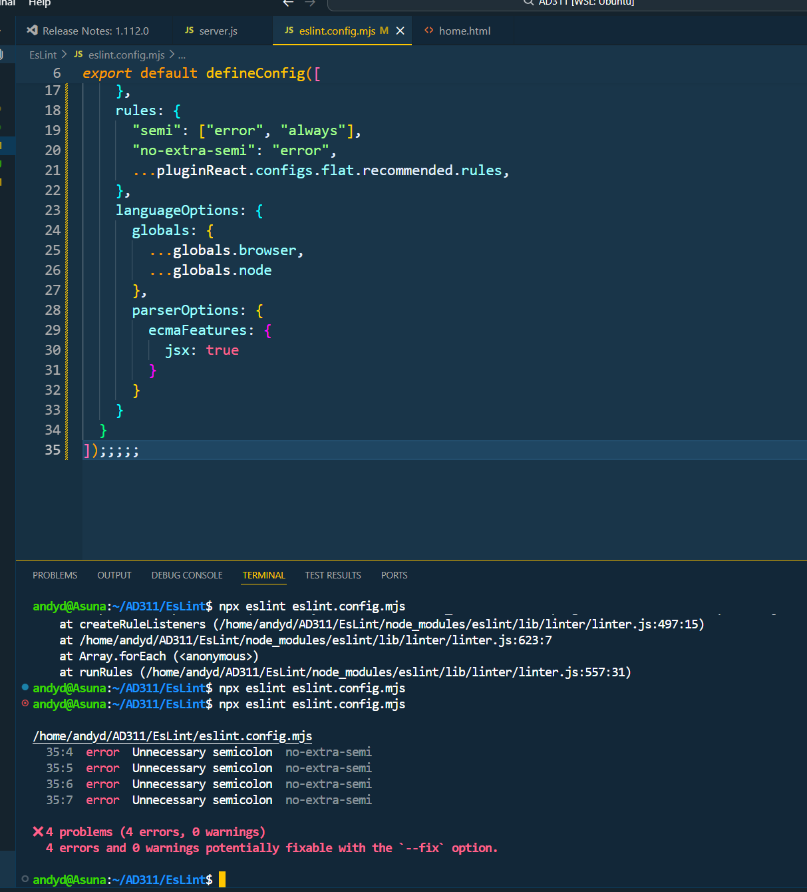
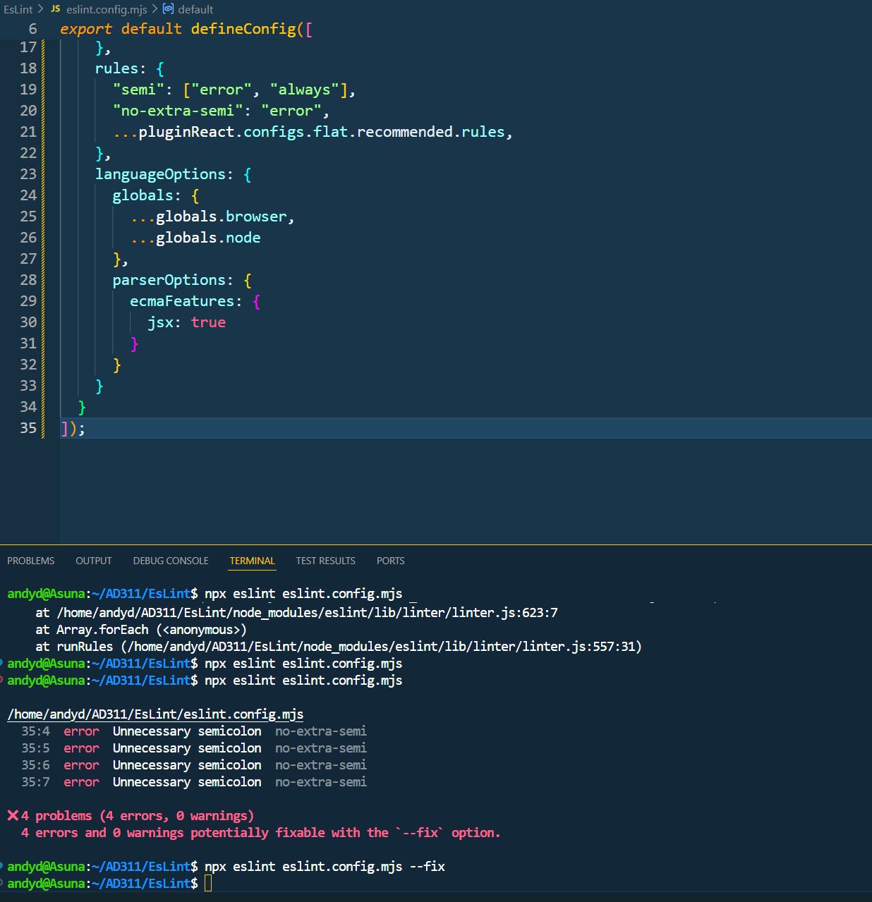

I followed just the steps listed on the assignment page. Whenever i encountered an error i asked gemini how i should solve it.
The first issue i had to resolve was adding a react version to the eslint.config.mjs file as it was not happy without knowing the version
ESLint can help more quickly resolve simple syntax errors which can sometimes be annoying to track down if doing something major where you may have
written hundreds of lines only for it to not work because of an extra or missing semicolon somewhere.

just running npx eslint eslint.config.mjs

after adding the --fix option
npx eslint eslint.config.mjs --fix

